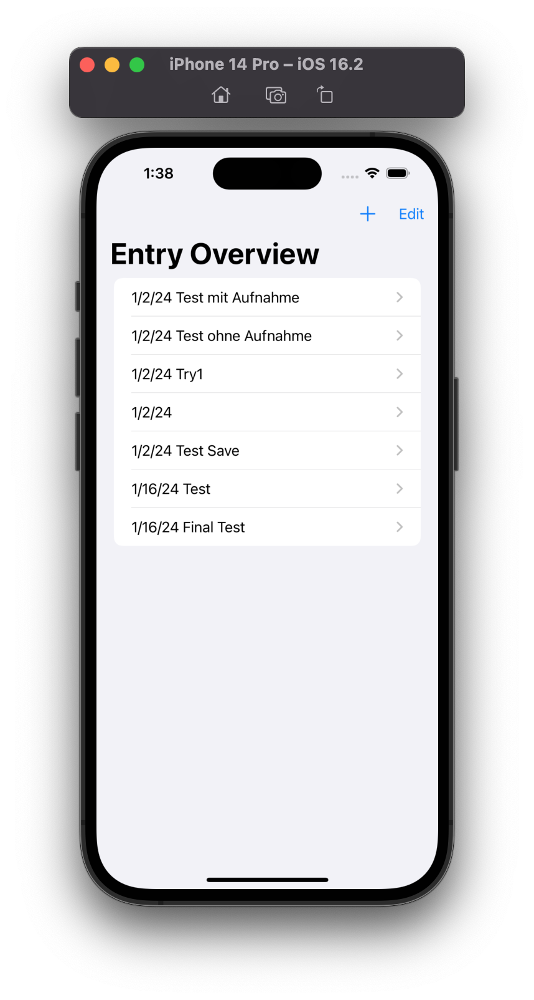
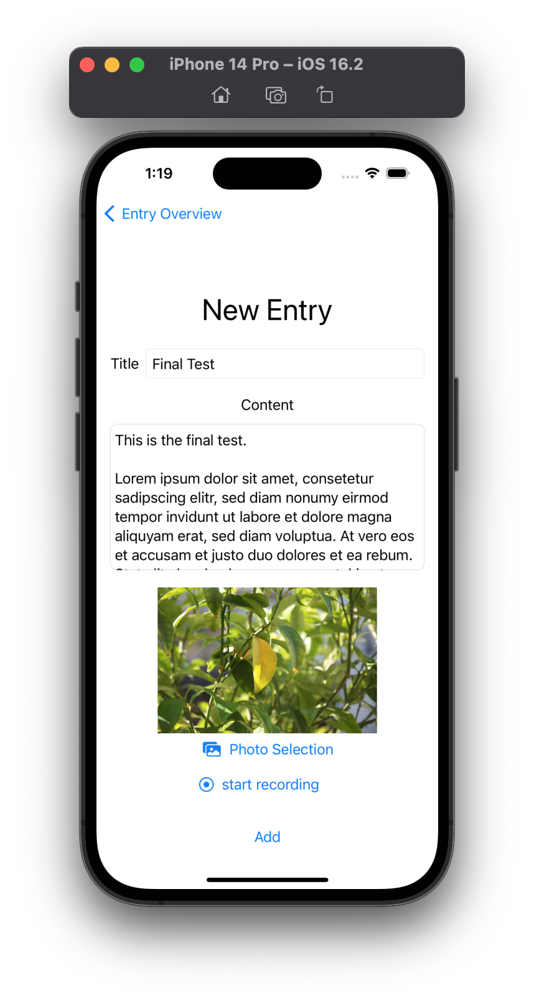
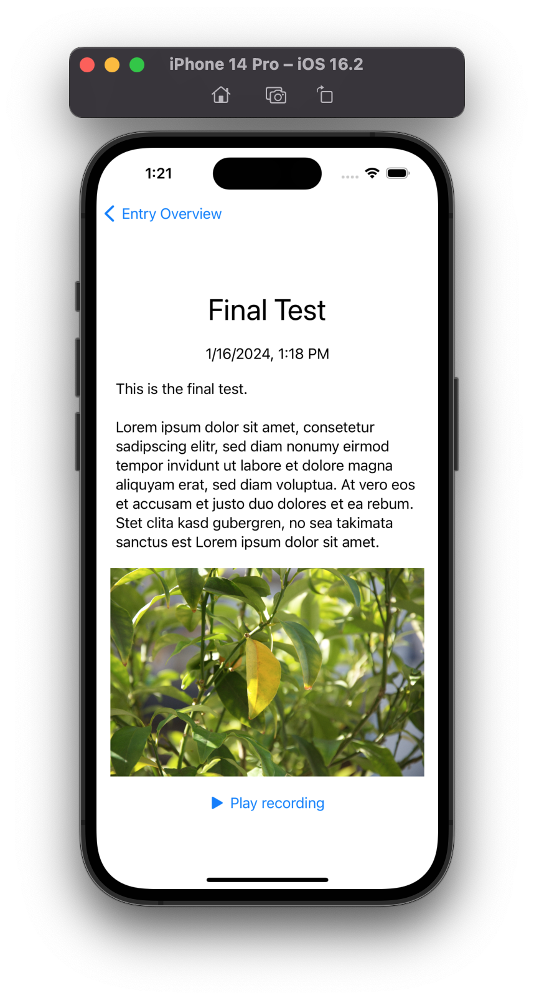

#  MyDay

## Description

My Day is a combination of Diray and Logbook. 

You can create Log-Entries with a title and a content where you describe what is happening right now. Additionally you can add a picture from your photos library or if you want you can make a voice recording.

All your Entries are shown in a list overview. When clicking on a list item you can see all the details of the selected Entry.

## Functionalities

For this App the following functionality were used:
- **Core Data** to persist created entries
- **Localization** for languages:
    - English
    - German
    - Russian
- **Local Notification** to remind the user once a day (at 9 am) to make an entry
- **PhotosPicker** so that the user can add a picture to his entries
- **Audio Player and Recorder** to add voice recordings to entries and play them

